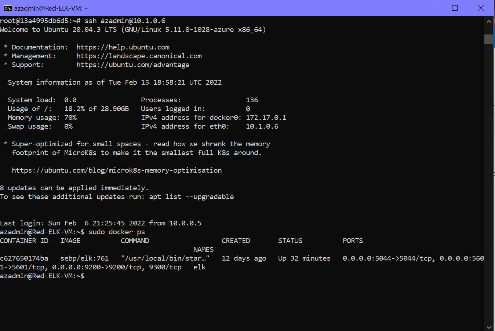

## Automated ELK Stack Deployment

The files in this repository were used to configure the network depicted below.

These files have been tested and used to generate a live ELK deployment on Azure. They can be used to either recreate the entire deployment pictured above. Alternatively, select portions of the YAML (.yml) file may be used to install only certain pieces of it, such as Filebeat.

  - [filebeat-installation](https://github.com/kikko-the-killer/safe-with-ELK/blob/main/ansible/filebeat-playbook.yml)
    - [filebeat-configuration](https://github.com/kikko-the-killer/safe-with-ELK/blob/main/ansible/filebeat-config.yml) 
  - [metricbeat-installation](https://github.com/kikko-the-killer/safe-with-ELK/blob/main/ansible/Metricbeat-Playbook.yml)
    - [metricbeat-configuration] (https://github.com/kikko-the-killer/safe-with-ELK/blob/main/ansible/metricbeat-config.yml)
  - [ELK-installation](https://github.com/kikko-the-killer/safe-with-ELK/blob/main/ansible/install-elk.yml)
     - [pentest-playbook] (https://github.com/kikko-the-killer/safe-with-ELK/blob/main/ansible/pentest-playbook.yml)
  - [ansible-hosts-file](https://github.com/kikko-the-killer/safe-with-ELK/blob/main/ansible/hosts.txt)
  - [ansible-configuration](https://github.com/kikko-the-killer/safe-with-ELK/blob/main/ansible/ansible.cfg.txt)

This document contains the following details:
- Description of the Topology
- Access Policies
- ELK Configuration
  - Beats in Use
  - Machines Being Monitored
- How to Use the Ansible Build

### Description of the Topology

The main purpose of this network is to expose a load-balanced and monitored instance of DVWA, the D*mn Vulnerable Web Application.

Load balancing ensures that the application will be highly available, in addition to restricting access to the network.
What aspect of security do load balancers protect? What is the advantage of a jump box?_

Load balancers help ensure that the servers cannot be brought offline, by limiting the potential impact of DDoS attacjs. SPecifically, using a public Cloud provider to load balance ensures that even if an attack transpires -- it does not effect the organization's own resources.
The jump box creates a centralized entryway into the Virtual Machines we've set up. This is beneficial because of a few reasons
There is only one entry way -- so it's easier to monitor 
Easier to manage, as new rules must only be applied to the Jump Box
Ease of automation
Network Segmentation

Integrating an ELK server allows users to easily monitor the vulnerable VMs for changes to the data and system logs. 
- What does Filebeat watch for?_
Filebeat generally reads all the specified data line by line, and forwards it to logstash or KIbana for further analysis. Specifically, a input is responsible for managing the harvesters and finding all sources to read from.A harvester is responsible for reading the content of a single file. The harvester reads each file, line by line, and sends the content to the output.
- What does Metricbeat record?
Metricbeat uses modules and metricsets uses logical sets and operators to collect, fetchh and structure data from a specific service. Metricbeat takes the metrics and statistics that it collects and ships them to the output that you specify, such as Elasticsearch or Logstash. 

The configuration details of each machine may be found below.

| Name  | Function | IP Address | Operating System |
|---|---|---|---|
| Jump Box Provisioner | Gateway | 10.0.0.5 | Linux |
| Web-1  | Web Server | 10.0.0.10 | Linux |
| Web-2 | Web Server | 10.0.0.7 | Linux |
| Web-3 | Web Server | 10.0.0.9 | Linux |
| Red-ELK-VM | ELK-Server | 10.1.0.6 | Linux |

### Access Policies

The machines on the internal network are not exposed to the public Internet. 

Only the Red-ELK-VM machine can accept connections from the Internet. Access to this machine is only allowed from the following IP addresses:
- The public IP address of admin machine -- using TCP port 5601

When setting up, access to the ELK VM is only allowed from the Jump Box Provisioner (10.0.0.5) via ssh on port 22, and via the web from admin IP(73.96.94.34) over TCP port 5601 

Alternate machines on the network can only be accessed through a Jump Box SHH on port 22, or through asdmin's machine with the specified IP via TCP port 5601. 

A summary of the access policies in place can be found in the table below.

| Name                 | Publically Accessible | Allowed IP Addresses                             |
|----------------------|-----------------------|--------------------------------------------------|
| Jump Box Provisioner | no                    | 73.96.94.34 though SSH                           |
| Web-1                | no                    | 10.0.0.5 through SSH                             |
| Web-2                | no                    | 10.0.0.5 through SSH                             |
| Web-3                | no                    | 10.0.0.5 through SSH                             |
| Red-ELK-VM           | no                    | 73.96.94.34 through HTTP AND 10.0.0.5 though SSH |

### Elk Configuration

Ansible was used to automate configuration of the ELK machine. No configuration was performed manually, which is advantageous because of efficiency that it is able to provide. Each machine does not have to be manually configured, and an automated process is programmed to address configuration on a multiutude of machines to the same standard simultaneously. 

The playbook implements the following tasks:
- set configurations for multiple VM's with docker
- add memory to the system
- pass the docker.io installation command
- set ports, and open the docker container with the specified information

The following screenshot displays the result of running `docker ps` after successfully configuring the ELK instance.

### Target Machines & Beats
This ELK server is configured to monitor the following machines:
- List the IP addresses of the machines you are monitoring:
	- Web-1: 10.0.0.10
	- Web-2: 10.0.0.7
	- Web-3: 10.0.0.9

We have installed the following Beats on these machines:
	- Filebeat and MetricBeat

These Beats allow us to collect the following information from each machine:

To better understand the monitoring performed on this network, there is a short explanation about the  kind of data each beat collects:_

    Filebeat: ships  log and file information about events on the system or network
    Metricbeat: ships data about metrics and system information from Operating Systems and services running on the server

    Additionally, alternate beats can be added to this setup if this is necessary to meet specific business needs.
 Packetbeat - which can be used with Elasticsearch to provide an application monitoring and performance analytics system
 Heartbeat - probe services to check if they are reachable or not � it's useful, for example, to verify that the service uptime complies with your SLA 
 Auditbeat - Auditbeat is a lightweight shipper that you can install on your servers to audit the activities of users and processes on your systems. For example, you can use Auditbeat to collect and centralize audit events from the Linux Audit Framework.

### Using the Playbook
In order to use the playbook, you will need to have an Ansible control node already configured. Assuming you have such a control node provisioned: 

SSH into the control node and follow the steps below:

For Filbeat:
- Copy the /etc/ansible/files/filebeat-config.yml file to /etc/filebeat/filebeat-playbook.yml.
- Update the filebeat-playbook.yml file to include curl -L -O https://artifacts.elastic.co/downloads/beats/filebeat/filebeat-8.0.0-amd64.deb
- Run the playbook, and navigate to ansible-playbook filebeat-playbook.yml to check that the installation worked as expected.

For Metricbeat:
 Copy the /etc/ansible/files/metricbeat file to /etc/metricbeat/metricbeat-playbook.yml.
- Update the filebeat-playbook.yml file to include curl -L -O https://artifacts.elastic.co/downloads/beats/metricbeat/metricbeat-8.0.0-amd64.deb
- Run the playbook, and navigate to ansible-playbook metricbeat-playbook.yml to check that the installation worked as expected.

There are three playbooks -- one for ansible, one for filebeat and the other for metric beat. They are located in /etc/ansible directory. They are all .yml files
- _Which file do you update to make Ansible run the playbook on a specific machine? How do I specify which machine to install the ELK server on versus which to install Filebeat on?

To make Ansible run the playbook on a specific machine, the ansible.config file, as well as the hosts file in the ansible directoty must be updated. The ansible.config file must be addited to include additional remote users, and the hosts file must be edited to include the IP addresses of webservers on which the playbook is meant to run.

To specify what you want installed on a specific machine ,you can edit the filebeat.config and metricbeat.config files to specify which hosts the playbook would run on. 

In order to check that the ELK server is running -- simply visit 
http://168.61.34.42:5601/app/kibana  -- where the IP is the extranal IP address of the ELK Server VM

