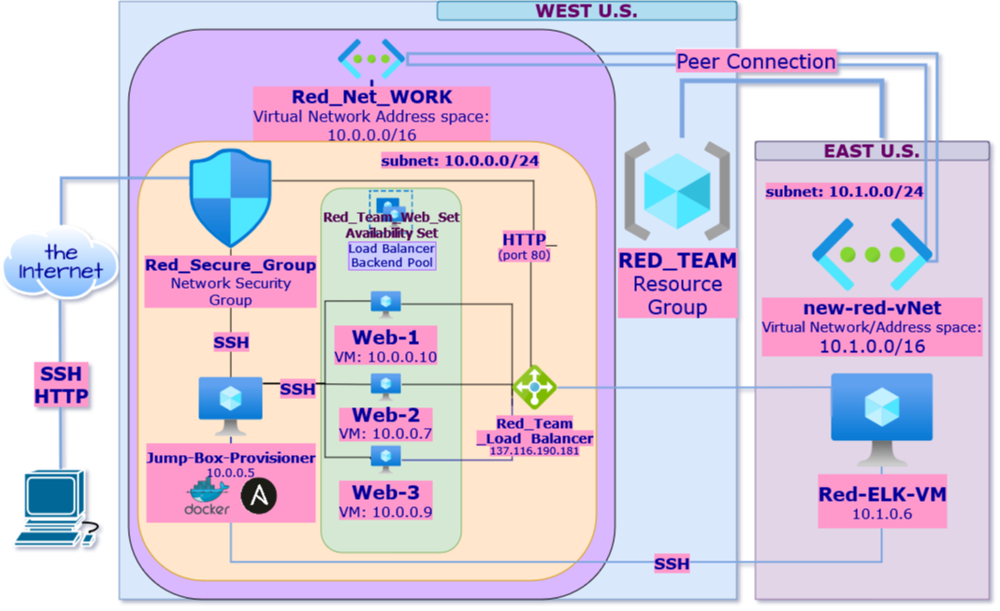

## Automated ELK Stack Deployment

The files in this repository were used to configure the network depicted below.

These files have been tested and used to generate a live ELK deployment on Azure. They can be used to either recreate the entire deployment pictured above. Alternatively, select portions of the _____ file may be used to install only certain pieces of it, such as Filebeat.

  - [filebeat-installation](https://github.com/kikko-the-killer/safe-with-ELK/blob/main/ansible/filebeat-playbook.yml)
  - [metricbeat-installation](https://github.com/kikko-the-killer/safe-with-ELK/blob/main/ansible/Metricbeat-Playbook.yml)
  - [ELK-installation](https://github.com/kikko-the-killer/safe-with-ELK/blob/main/ansible/install-elk.yml)

This document contains the following details:
- Description of the Topology
- Access Policies
- ELK Configuration
  - Beats in Use
  - Machines Being Monitored
- How to Use the Ansible Build

### Description of the Topology

The main purpose of this network is to expose a load-balanced and monitored instance of DVWA, the D*mn Vulnerable Web Application.

Load balancing ensures that the application will be highly available, in addition to restricting access to the network.
What aspect of security do load balancers protect? What is the advantage of a jump box?_

Load balancers help ensure that the servers cannot be brought offline, by limiting the potential impact of DDoS attacjs. SPecifically, using a public Cloud provider to load balance ensures that even if an attack transpires -- it does not effect the organization's own resources.
The jump box creates a centralized entryway into the Virtual Machines we've set up. This is beneficial because of a few reasons
There is only one entry way -- so it's easier to monitor 
Easier to manage, as new rules must only be applied to the Jump Box
Ease of automation
Network Segmentation

Integrating an ELK server allows users to easily monitor the vulnerable VMs for changes to the data and system logs. 
- What does Filebeat watch for?_
Filebeat generally reads all the specified data line by line, and forwards it to logstash or KIbana for further analysis. Specifically, a input is responsible for managing the harvesters and finding all sources to read from.A harvester is responsible for reading the content of a single file. The harvester reads each file, line by line, and sends the content to the output.
- What does Metricbeat record?
Metricbeat uses modules and metricsets uses logical sets and operators to collect, fetchh and structure data from a specific service. Metricbeat takes the metrics and statistics that it collects and ships them to the output that you specify, such as Elasticsearch or Logstash. 

- EXTRA: What other beats can be added to this setup and why?
 Packetbeat - that you can use with Elasticsearch to provide an application monitoring and performance analytics system
 Heartbeat - probe services to check if they are reachable or not � it's useful, for example, to verify that the service uptime complies with your SLA 
 Auditbeat - Auditbeat is a lightweight shipper that you can install on your servers to audit the activities of users and processes on your systems. For example, you can use Auditbeat to collect and centralize audit events from the Linux Audit Framework.

The configuration details of each machine may be found below.
_Note: Use the [Markdown Table Generator

| Name     | Function | IP Address | Operating System |
|----------|----------|------------|------------------|
| Jump Box | Gateway  | 10.0.0.1   | Linux            |
| TODO     |          |            |                  |
| TODO     |          |            |                  |
| TODO     |          |            |                  |

| Name  | Function | IP Address | Operating System |
|---|---|---|---|
| Jump Box Provisioner | Gateway | 10.0.0.5 | Linux |
| Web-1  | Web Server | 10.0.0.10 | Linux |
| Web-2 | Web Server | 10.0.0.7 | Linux |
| Web-3 | Web Server | 10.0.0.9 | Linux |
| Red-ELK-VM | ELK-Server | 10.1.0.6 | Linux |

### Access Policies

The machines on the internal network are not exposed to the public Internet. 

Only the Red-ELK-VM machine can accept connections from the Internet. Access to this machine is only allowed from the following IP addresses:
- The public IP address of admin machine -- 73.96.94.34

- _TODO: Which machine did you allow to access your ELK VM? What was its IP address?_

Machines within the network can only be accessed by ssh through Jumbox and TCP through HTTP -- oirts 22 for ssh and 5601 for TCP.

A summary of the access policies in place can be found in the table below.

| Name     | Publicly Accessible | Allowed IP Addresses |
|----------|---------------------|----------------------|
| Jump Box | Yes/No              | 73.96.94.34|
|          |                     |                      |
|          |                     |                      |

| Name                 | Publically Accessible | Allowed IP Addresses                             |
|----------------------|-----------------------|--------------------------------------------------|
| Jump Box Provisioner | no                    | 73.96.94.34 though SSH                           |
| Web-1                | no                    | 10.0.0.5 through SSH                             |
| Web-2                | no                    | 10.0.0.5 through SSH                             |
| Web-3                | no                    | 10.0.0.5 through SSH                             |
| Red-ELK-VM           | no                    | 73.96.94.34 through HTTP AND 10.0.0.5 though SSH |

### Elk Configuration

Ansible was used to automate configuration of the ELK machine. No configuration was performed manually, which is advantageous because...
What is the main advantage of automating configuration with Ansible?

Each machine does not have to be manually configured, and an automated process can be created, which will configure a multiutude of machines to the same standard simultaneously. 

The playbook implements the following tasks:
- _TODO: In 3-5 bullets, explain the steps of the ELK installation play. E.g., install Docker; download image; etc._
- ...
- ...

The following screenshot displays the result of running `docker ps` after successfully configuring the ELK instance.

### Target Machines & Beats
This ELK server is configured to monitor the following machines:
- List the IP addresses of the machines you are monitoring_
	- Web-1: 10.0.0.10
	- Web-2: 10.0.0.7
	- Web-3: 10.0.0.9

We have installed the following Beats on these machines:
-Specify which Beats you successfully installed_
	- Filebeat and MetricBeat

These Beats allow us to collect the following information from each machine:
- _TODO: In 1-2 sentences, explain what kind of data each beat collects, and provide 1 example of what you expect to see. E.g., `Winlogbeat` collects Windows logs, which we use to track user logon events, etc._

    Filebeat: log events
    Metricbeat: metrics and system statistics

### Using the Playbook
In order to use the playbook, you will need to have an Ansible control node already configured. Assuming you have such a control node provisioned: 

SSH into the control node and follow the steps below:
- Copy the _____ file to _____.
- Update the _____ file to include...
- Run the playbook, and navigate to ansible-playbook filebeat-playbook.yml to check that the installation worked as expected.

_TODO: Answer the following questions to fill in the blanks:_
- _Which file is the playbook? Where do you copy it?
There are three playbooks -- one for ansible, one for filebeat and the other for metric beat. They are located in /etc/ansible directory. They are all .yml files
- _Which file do you update to make Ansible run the playbook on a specific machine? How do I specify which machine to install the ELK server on versus which to install Filebeat on?
You update the hosts file. You specify what you want installed on a specific machine by ..?
- _Which URL do you navigate to in order to check that the ELK server is running?
http:// [your.ELK-VM.External.IP]:5601/app/kibana

_As a **Bonus**, provide the specific commands the user will need to run to download the playbook, update the files, etc._